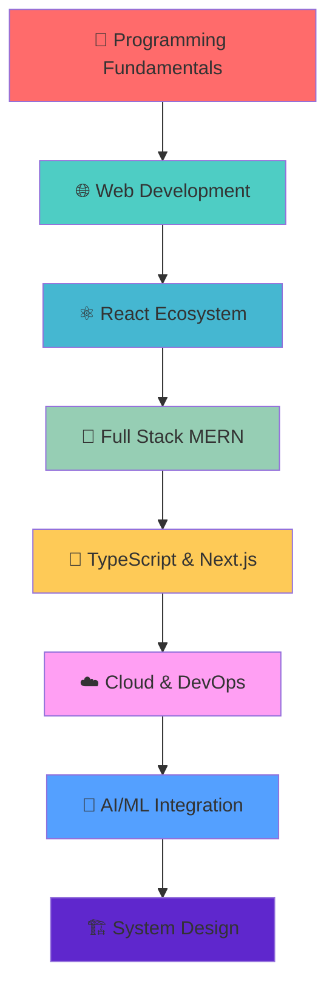

<div align="center">
  
  
  <h1>
    
  </h1>
  
  <h3 align="center">🌟 Passionate Full Stack Developer | 🚀 MERN Stack Enthusiast | 💡 Innovation Seeker</h3>
  
  <p align="center">
    
    
    
  </p>
  
</div>


## 🚀 About Me


```javascript
const sayam = {
    pronouns: "He" | "Him",
    code: ["JavaScript", "Python", "Java", "C"],
    askMeAbout: ["Web Dev", "Tech", "App Dev", "Photography"],
    technologies: {
        frontEnd: {
            js: ["React", "Next.js"],
            css: ["Tailwind", "Bootstrap", "Material-UI"]
        },
        backEnd: {
            js: ["Node", "Express"],
            python: ["Django", "Flask"]
        },
        databases: ["MongoDB", "MySQL", "PostgreSQL"],
        misc: ["Firebase", "Socket.IO", "Docker"]
    },
    currentFocus: "Building scalable web applications",
    funFact: "I debug with console.log and I'm proud of it! 🐛"
};
```

<br>

- 🔭 **Currently Working On:** Advanced Learning Management System with AI features
- 🌱 **Learning:** TypeScript, Next.js, Docker, AWS, and System Design
- 👯 **Looking to Collaborate:** Open source projects and innovative startups
- 💬 **Ask Me About:** JavaScript, React, Node.js, MongoDB, System Design
- 📫 **Reach Me:** [sayamdas9124@gmail.com](mailto:sayamdas9124@gmail.com)
- ⚡ **Fun Fact:** I can code for 12 hours straight with just coffee! ☕


## 🎯 2025 Vision & Goals

<div align="center">

| 🎯 **Goals** | 📊 **Progress** | 🎉 **Status** |
|:---:|:---:|:---:|
| Complete 10+ Full Stack Projects | 6/10 | 🔥 In Progress |
| Contribute to 15+ Open Source | 3/15 | 🚀 Active |
| Master TypeScript & Next.js | 70% | 📚 Learning |
| Build 3 SaaS Applications | 1/3 | 💡 Planning |
| Learn DevOps & Cloud (AWS) | 40% | ☁️ Exploring |
| Strengthen DSA & System Design | 60% | 🧠 Practicing |

</div>


## 🛠️ Tech Arsenal

<div align="center">

### 🌐 Frontend Mastery
<p>
  
</p>

### ⚙️ Backend Powerhouse  
<p>
  
</p>

### 🗄️ Database & Cloud
<p>
  
</p>

### 🔧 Development Tools
<p>
  
</p>

### 📱 Programming Languages
<p>
  
</p>

</div>


## 📊 GitHub Analytics & Performance

<div align="center">
  
   
  
  
  
</div>

<div align="center">
  
  
  
</div>

<div align="center">
  
  
  
</div>


## 🏆 GitHub Achievements & Trophies

<div align="center">
  
  
  
</div>


## 🎯 Learning & Development Roadmap

<div align="center">



</div>

### 🎓 **Mastered Technologies** ✅
- **Languages:** JavaScript (ES6+), Python, Java, C/C++
- **Frontend:** React.js, HTML5, CSS3, Bootstrap, Tailwind CSS
- **Backend:** Node.js, Express.js, RESTful APIs
- **Databases:** MongoDB, MySQL, Firebase
- **Tools:** Git, GitHub, VS Code, Postman, Figma

### 🔄 **Currently Learning** 
- **Advanced:** TypeScript, Next.js, Redux Toolkit
- **Backend:** GraphQL, Microservices Architecture
- **DevOps:** Docker, AWS, CI/CD Pipelines
- **Testing:** Jest, Cypress, Unit Testing

### 🚀 **Future Learning Goals**
- **Cloud:** AWS Certification, Serverless Architecture
- **Mobile:** React Native, Flutter
- **AI/ML:** TensorFlow, PyTorch, OpenAI APIs
- **System Design:** Scalable Architecture, Load Balancing


## 🌐 Connect & Collaborate

<div align="center">
  
  <a href="mailto:sayamdas9124@gmail.com">
    
  </a>
  <a href="#">
    
  </a>
  <a href="#">
    
  </a>
  <a href="#">
    
  </a>
  <a href="#">
    
  </a>
  <a href="#">
    
  </a>
  
</div>


## 💡 Daily Dev Inspiration

<div align="center">
  
  
  
</div>


## 🐍 Contribution Graph

<div align="center">
  
  
  
</div>


## 🎵 Coding Playlist

<div align="center">

| 🎧 **Mood** | 🎵 **Genre** | ⚡ **Energy Level** |
|:---:|:---:|:---:|
| Deep Focus | Lo-fi Hip Hop | 🔥🔥🔥 |
| Problem Solving | Electronic/Synthwave | 🚀🚀🚀🚀 |
| Debugging | Classical/Ambient | 🧠🧠🧠 |
| Feature Building | Upbeat Pop/Rock | ⚡⚡⚡⚡⚡ |

</div>


<div align="center">
  
  <h2>💖 Thanks for Visiting My Digital Space!</h2>
  
   <em><b>I love connecting with different people</b> so if you want to say <b>hi, I'll be happy to meet you more!</b> 😊</em>
  
  <br><br>
  
  **"The best way to predict the future is to create it." - Peter Drucker**
  
  <br>
  
  
  
</div>


